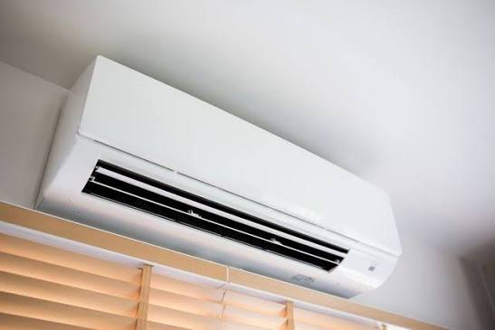

# Machine-for-cleaning-air-conditioner-dust
Problem Statement

-Zan Hao has a uncle that	his name called tey jie wen, he has a back pain, his 45 and his job was to fix air conditioner

Solution for the problem

- A dust sensor(a light, a light sensor, A red light)

why do we make a dust sensor?

- the purpose of making the sensor is to detect the thickness of the dust in the filter gauze

Beneficiary and Desired Impact

- Cause uncle Jie Wen has a back pain, he no need to use ladder for climbing up and down any more, he can just use the sensor to let his job easier and saver

https://docs.google.com/presentation/d/1jB6Oc7MsP_atcBfOPBKNUA2kbRIdzzOby08PAfm7Lpg/edit?slide=id.g27cb35148c0_0_5#slide=id.g27cb35148c0_0_5
